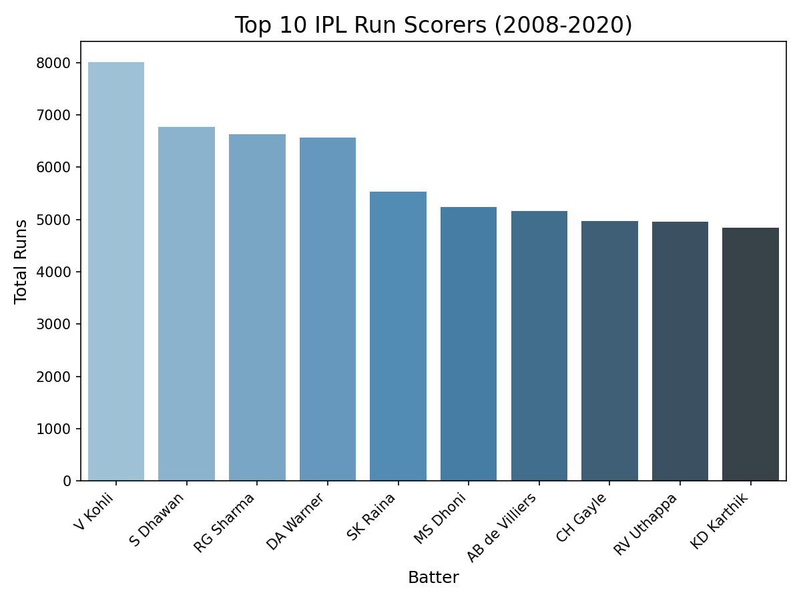
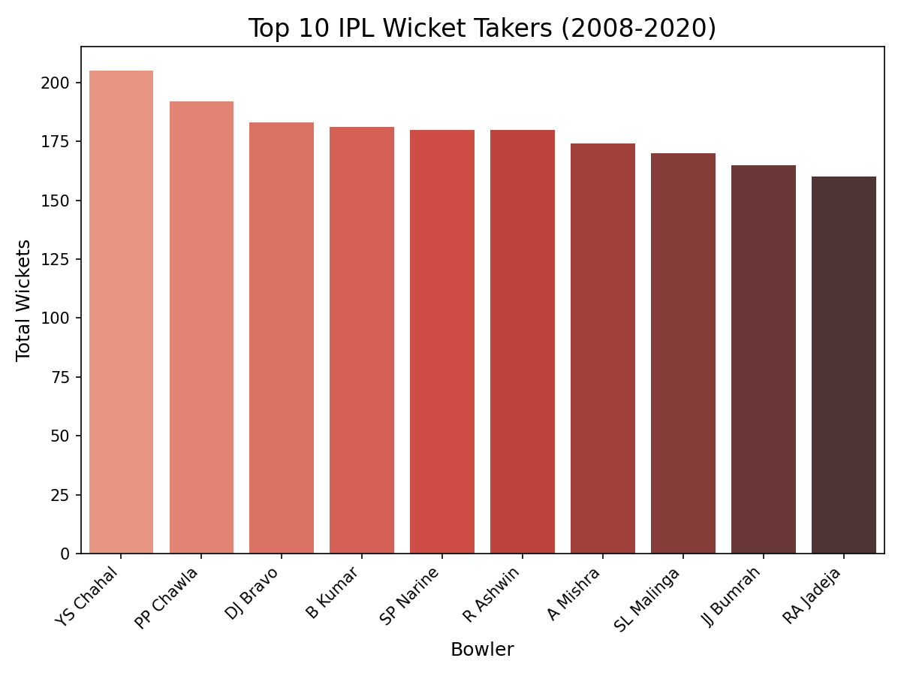
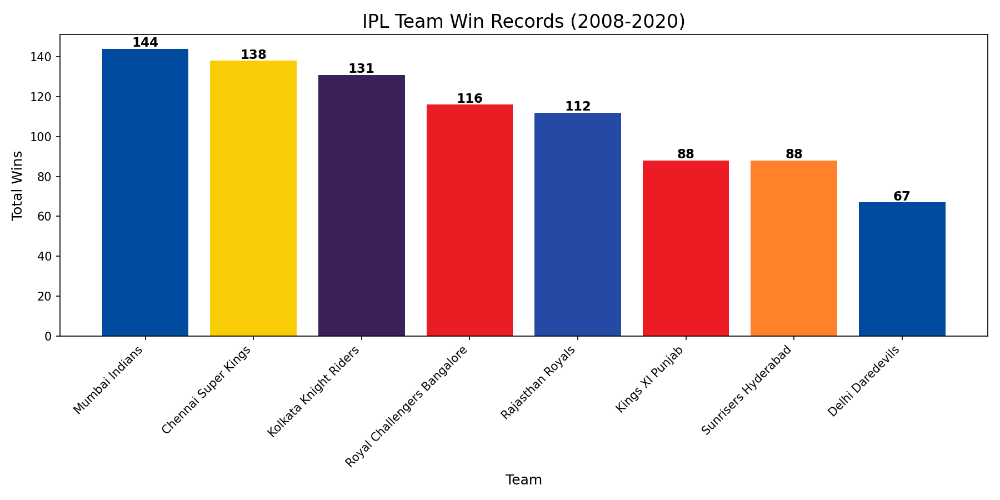
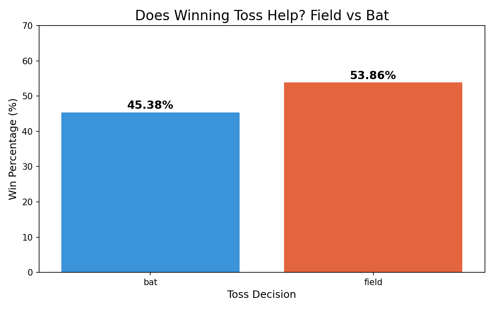

# 🏏 IPL Player Performance Analyzer (2008–2024)

## Project Overview
End-to-end data analysis project analyzing 15+ seasons of IPL cricket data 
across 1,095 matches and 260,920+ ball-by-ball deliveries.

Built using SQL (MySQL), Python (Pandas, Matplotlib, Seaborn) 
and Power BI for interactive dashboards.

## Key Business Questions Answered
1. Who are the top run scorers — and who is most efficient per match?
2. Which bowlers take the most wickets — and who is most lethal per game?
3. Which team has the best win record across IPL history?
4. Does winning the toss actually help? Field or bat?
5. How has IPL scoring evolved season by season?

## Key Insights Discovered
- **Virat Kohli** leads total runs (8,004) but **David Warner** 
  is more efficient at 35.68 avg runs per match vs Kohli's 32.80
- **JJ Bumrah** is the most lethal bowler at 1.92 wickets per match 
  despite not leading total wickets
- **RCB has 116 wins** — 4th highest — yet ZERO IPL titles ever (wins in 2025)
- Teams choosing to **field after winning toss win 53.86%** of matches 
  vs 45.38% when batting — chasing is statistically superior
- IPL avg runs per match grew from **286 in 2009 to 366 in 2024** — 
  a 28% increase showing batters dominating more every year

## Tools Used
| Tool | Purpose |
|------|---------|
| MySQL | Data storage, cleaning, analytical queries |
| Python (Pandas) | Data processing, aggregation, export |
| Matplotlib & Seaborn | Data visualization charts |
| Power BI | Interactive 3-page dashboard |
| GitHub | Version control and portfolio |

## Dashboard Pages
- **Page 1 — Batting Analysis:** Top scorers, efficiency comparison
- **Page 2 — Bowling Analysis:** Wicket takers, scatter plot efficiency
- **Page 3 — Match Insights:** Team wins, toss impact, season trends

## Dataset
Source: Kaggle — IPL Complete Dataset (2008–2020)
- matches.csv — 1,095 matches
- deliveries.csv — 260,920+ ball-by-ball records

## Dashboard Preview

